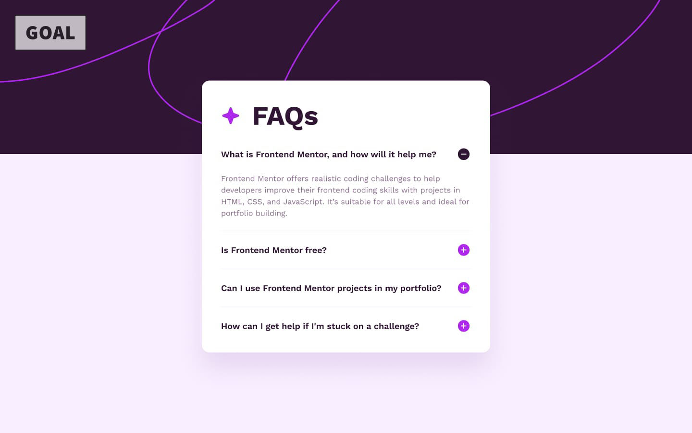
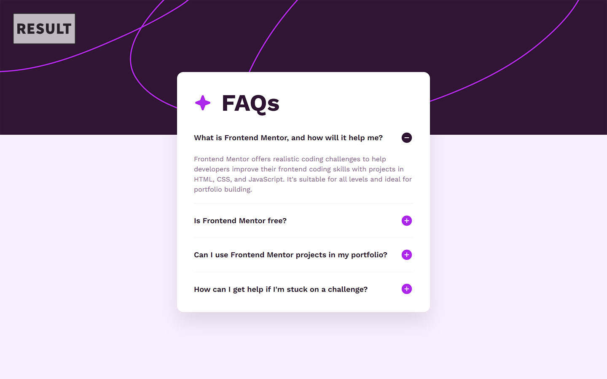

# Frontend Mentor - FAQ accordion solution

This is a solution to the [FAQ accordion challenge on Frontend Mentor](https://www.frontendmentor.io/challenges/faq-accordion-wyfFdeBwBz).

I used this challenge to brush up my skills in vanilla JavaScript and accessibility related problems.

## Table of contents

- [Overview](#overview)
  - [Challenge goal](#challenge-goal)
  - [Try it out](#try-it-out)
- [My process](#my-process)
  - [Built with](#built-with)
  - [What I learned](#what-i-learned)
  - [What I could improve](#what-i-could-improve)
- [Author](#author)

## Overview

### Challenge goal



The challenge brief indicated that users should be able to:

- Hide/Show the answer to a question when the question is clicked
- Navigate the questions and hide/show answers using keyboard navigation alone
- View the optimal layout for the interface depending on their device's screen size
- See hover and focus states for all interactive elements on the page

#### Result preview




### Try it out

- Interact with the result here: [https://dhollard.github.io/practice-qrcode-component-card/](https://dhollard.github.io/practice-faq-accordion-js/)

## My process

Here is the overall approach I took:

1. structured my project elements first
2. built the HTML structure
3. then the CSS styling
4. then the JS interactions
5. Finally, I went back across all aspects to fix and improve some things as the component became more complex.

I tried to replicate the desired look best I could, with access only to screenshots. Which means I had to guess exact quotes by looking and comparing.

```html
<!-- Accordion collapsible tab example -->
<div class="accordion-tab acc-opened-tab">
  <button class="acc-tab-header" aria-controls="accor-desc-01" aria-expanded="true">
    <h2 class="acc-tab-title">FAQ question title?</h2>
    <div class="acc-tab-state-ico" role="img" aria-hidden="true"></div>
  </button>

  <div class="acc-tab-content" id="accor-desc-01">
    <p>Text paragraph.</p>
  </div>
</div>
```

I achieved every technical aspect enunciated in the challenge brief and even added some extra features.

Since "keyboard interactions" were not detailed beyond opening/closing/cycling through, I chose to trigger opening and closing through the use of the "enter" key.

I also added the ability to go to the first accordion tab by pressing the "Home" key and the last tab by pressing the "End" key for extra flexibility.

### Built with

- Semantic HTML5 markup
- SCSS
- Flexbox and CSS variables
- Mobile-first workflow
- ARIA attributes and accessibility in mind
- Attention to detail

### What I learned

This challenge allowed me to review my JavaScript and ARIA knowledge in a fun and challenging exercice.

I do not always think of adding keyboard support to elements I create, and this challenge has made me more aware of that.

### What I could improve

I made the mistake to tackle the CSS animation of opening/closing tabs too late, which meant I either had to animate the max-height property or to rework everything to be able to use more/better options.

I chose the first option because I did not want to spend extra time on this challenge, but that means the animation can be a little rougher than I'd like it to be.

Similarly, I tried my best to match the challenge design, but I'm sure it could still be improved marginally with more time.

## Author

- Website - [darius-hollard.com](https://darius-hollard.com/)
- Frontend Mentor - [@dhollard](https://www.frontendmentor.io/profile/dhollard)
